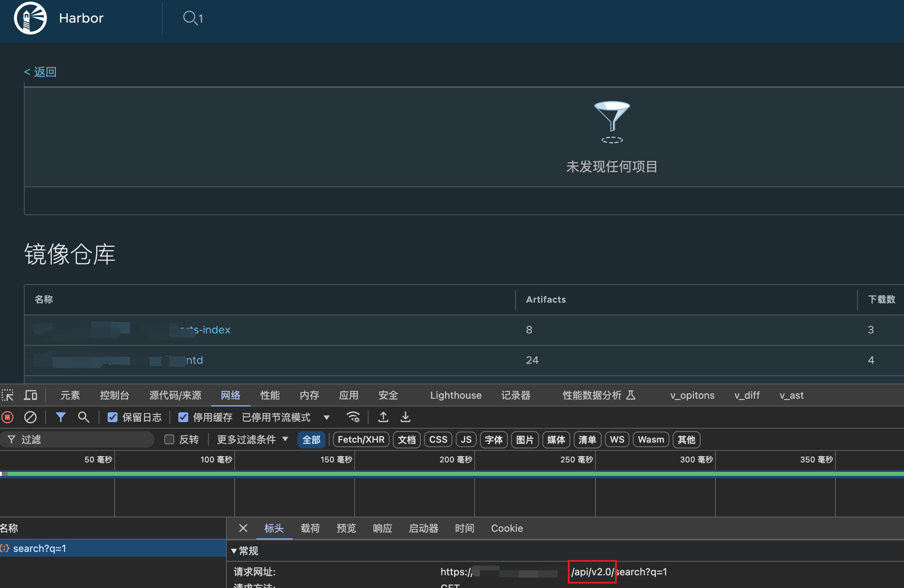
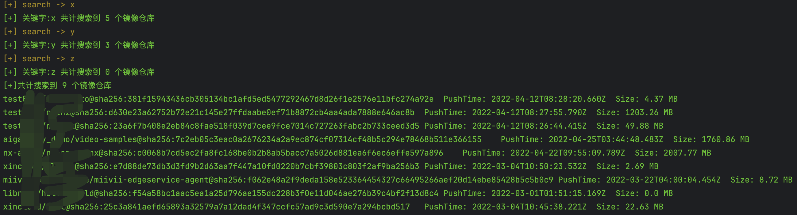
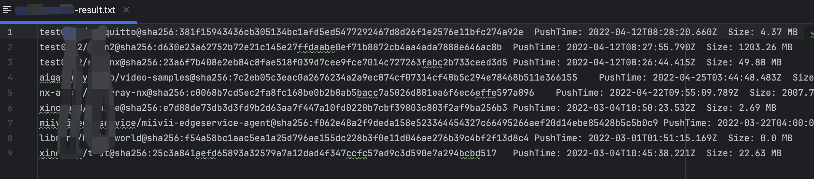
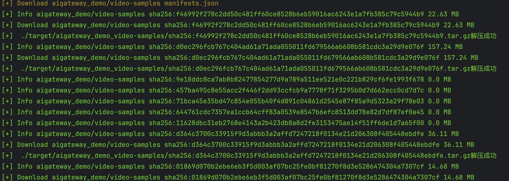
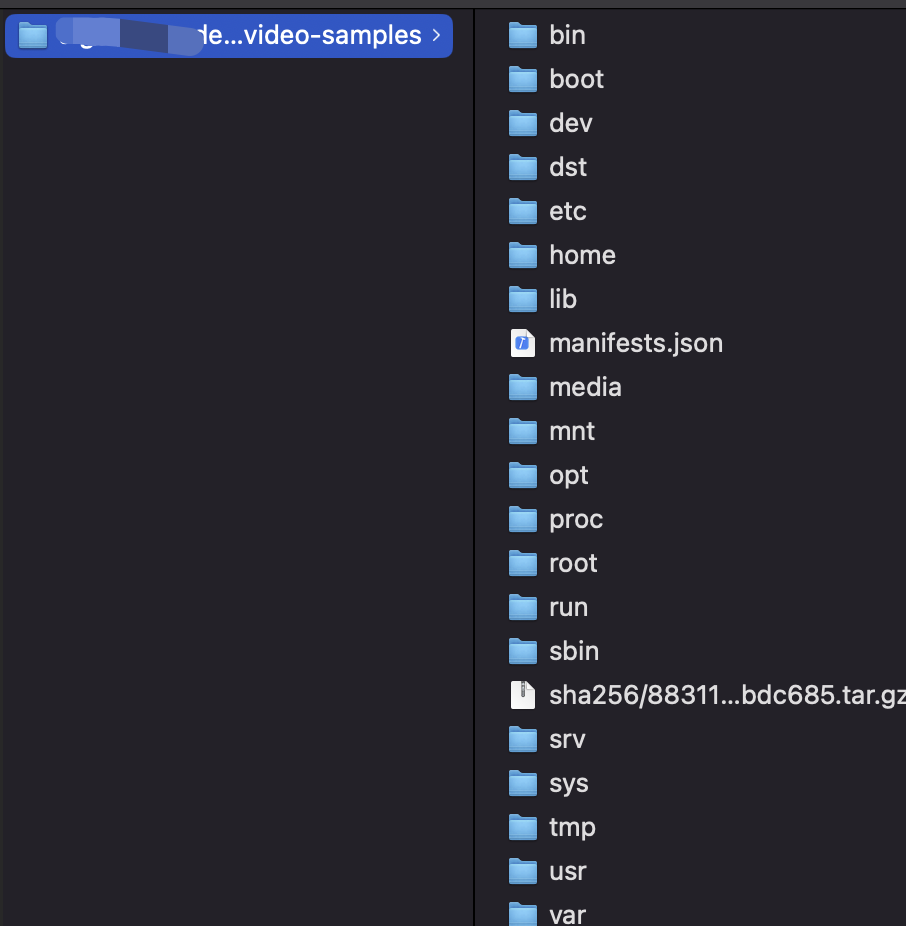

# 团队介绍
> **重庆九宫格安全团队**致力于分享开源安全工具、研究方向覆盖红蓝对抗、Web安全、移动安全、安全开发、企业安全建设、物联网/工控安全/AI/量子安全等多个领域，对安全感兴趣的小伙伴可以关注我们。

# harbor CVE-2022-46463 全自动下载脚本
> 实战攻防演练中或供应链攻击中，经常会碰到harbor系统，由于开发人员权限错误配置或需要公开镜像等原因，这时候就需要一款全自动功能的脚本：
- 搜索遍历镜像项目
- 原生下载镜像（不调用docker，直接使用requests直接下载）
- 自动解压镜像压缩包，你还可以补充自定义寻找jar资源等
- 支持harbor v1和v2版本

# 脚本演示

首先确认harbor api版本号，可通过抓搜索包得知，api版本为v2.0：

v1版本为：http://x.x.x.x/api/search?q=1

修改脚本相关参数，运行脚本，将会输出相关信息及镜像信息保存到文本文件中

编辑生成的文本文件，这时候就需要人工来删除不需要下载的镜像，可根据镜像名称、镜像大小、镜像时间来综合判断：

编辑完文本文件后，修改脚本填入文件路径，运行将会自动下载镜像和解压镜像

将在target目录下看到所有解压后的文件：
